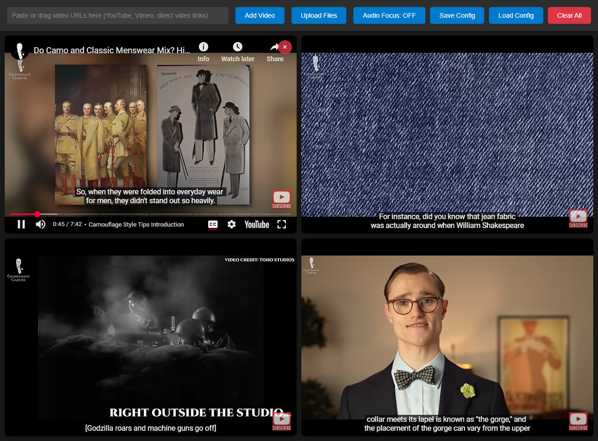

# GridPlay 🎥

A powerful, intuitive multi-video grid player that lets you watch multiple video streams simultaneously. Perfect for monitoring, comparison, research, and content curation.

[GridPlay Demo](https://gridplay.hisenz.com/)



## ✨ Features

### 🎯 **Multi-Source Support**
- **YouTube** videos (direct URLs, shorts, embeds)
- **Vimeo** content
- **Local video files** (MP4, WebM, AVI, MOV)
- **Direct video URLs** from any website
- **Cross-platform** drag & drop support

### 🎮 **Intuitive Interface**
- **Drag & drop** videos from browser tabs, file explorer, or text selection
- **Auto-arranging grids** (1x1, 2x2, 3x3, and more)
- **Hover controls** - video controls appear only when needed
- **Clean, dark theme** optimized for focus

### 🔧 **Smart Features**
- **Auto-muted start** - no audio chaos when loading multiple videos
- **Closed captions** enabled by default when available
- **Save/Load configurations** - preserve your video setups
- **Responsive design** - works on any screen size
- **No installation** - runs entirely in your browser

## 🚀 Quick Start

1. **Download** `gridplay.html` or clone this repository
2. **Open** the HTML file in any modern browser
3. **Drag & drop** video files or URLs onto the interface
4. **Arrange** your perfect multi-video setup!

## 📖 How to Use

### Adding Videos
- **Drag URLs** from your browser address bar
- **Drag video files** from your computer
- **Paste URLs** in the input field
- **Upload files** using the upload button

### Managing Your Grid
- **Hover over videos** to see controls
- **Click the X** on any video to remove it
- **Save your setup** with the "Save Config" button
- **Load previous setups** with "Load Config"

### Supported URL Formats
```
YouTube:
- https://youtube.com/watch?v=VIDEO_ID
- https://youtu.be/VIDEO_ID
- https://youtube.com/shorts/VIDEO_ID

Vimeo:
- https://vimeo.com/VIDEO_ID

Direct Videos:
- https://example.com/video.mp4
- Any direct video link
```

## 🛠️ Technical Details

### Requirements
- **Modern web browser** (Chrome, Firefox, Safari, Edge)
- **JavaScript enabled**
- **Internet connection** (for streaming videos)

### Architecture
- **Static web application** - no server required
- **Vanilla JavaScript** - no dependencies
- **HTML5 video APIs** - native browser support
- **CSS Grid & Flexbox** - responsive layouts

### Browser Compatibility
| Feature | Chrome | Firefox | Safari | Edge |
|---------|--------|---------|--------|------|
| Video Playback | ✅ | ✅ | ✅ | ✅ |
| Drag & Drop | ✅ | ✅ | ✅ | ✅ |
| YouTube Embeds | ✅ | ✅ | ✅ | ✅ |
| Local Files | ✅ | ✅ | ✅ | ✅ |

## 🎨 Use Cases

### 📺 **Content Monitoring**
- Social media managers tracking multiple live streams
- News monitoring across different sources
- Event coverage from multiple angles

### 🔬 **Research & Analysis**
- Comparing video content side-by-side
- Educational material review
- Market research and competitor analysis

### 🎬 **Creative Workflows**
- Video editors reviewing multiple cuts
- Content creators planning layouts
- Film students analyzing techniques

### 💼 **Professional Applications**
- Security monitoring (multiple camera feeds)
- Trading floor displays (multiple news sources)
- Presentation setups for conferences

## ⚙️ Configuration

### Saving Configurations
Configurations are saved as JSON files containing:
```json
{
  "videos": [
    {
      "id": "video-1",
      "src": "https://youtube.com/watch?v=...",
      "name": "Video Title"
    }
  ],
  "timestamp": "2025-08-10T14:35:22.000Z",
  "version": "1.0"
}
```

### Grid Layouts
GridPlay automatically chooses the optimal layout:
- **1 video**: Full screen
- **2 videos**: Side by side
- **3 videos**: Triangular arrangement
- **4 videos**: 2×2 grid
- **6 videos**: 3×2 grid
- **9+ videos**: 3×3 grid

## 🔧 Customization

### Modifying the Interface
The entire application is contained in a single HTML file. You can customize:
- **Colors and styling** in the `<style>` section
- **Grid layouts** by modifying the CSS grid classes
- **Supported platforms** by editing the URL detection functions

### Adding New Video Platforms
To add support for new video platforms:

1. **Add URL detection** in the `addVideo()` function
2. **Create conversion function** (like `convertYouTubeUrl()`)
3. **Add embed template** in the video element creation

## 🐛 Troubleshooting

### Video Won't Load
- **Check URL format** - ensure it's a direct video link or supported platform
- **Embedding restrictions** - some videos block embedding (will show fallback link)
- **CORS issues** - some direct URLs may not work due to server restrictions

### Drag & Drop Not Working
- **Browser security** - ensure you're not dragging from HTTPS to HTTP
- **File permissions** - check if browser has access to local files
- **Clear browser cache** - refresh the page and try again

### Performance Issues
- **Too many videos** - limit to 9 videos for optimal performance
- **Large file sizes** - compress videos for better streaming
- **Browser memory** - close other tabs if experiencing lag

## 📝 License

This project is licensed under the MIT License - see the [LICENSE](LICENSE) file for details.

## 🤝 Contributing

Contributions are welcome! Please feel free to:
- **Report bugs** via GitHub Issues
- **Suggest features** in the Discussions section
- **Submit pull requests** with improvements
- **Share your use cases** to help improve the tool

## 🙋 Support

Having issues? Here's how to get help:
1. **Check the troubleshooting section** above
2. **Search existing issues** on GitHub
3. **Create a new issue** with details about your problem
4. **Include browser version** and error messages if any

## 🎉 Acknowledgments

- Built with modern web standards for maximum compatibility
- Inspired by video wall solutions and multi-monitor setups
- Designed for creators, researchers, and professionals

---

**Made with ❤️ for the video-watching community**

*GridPlay - Watch Multiple Videos, Stay Organized*
